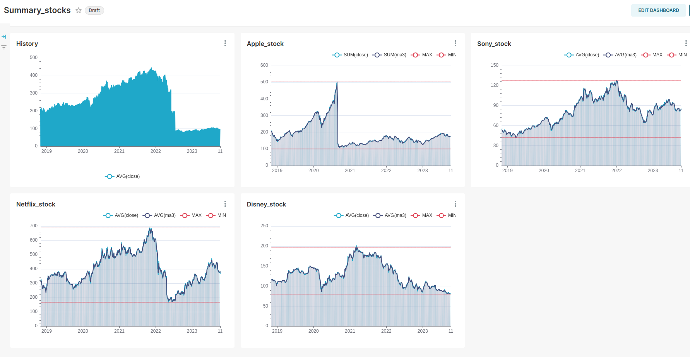
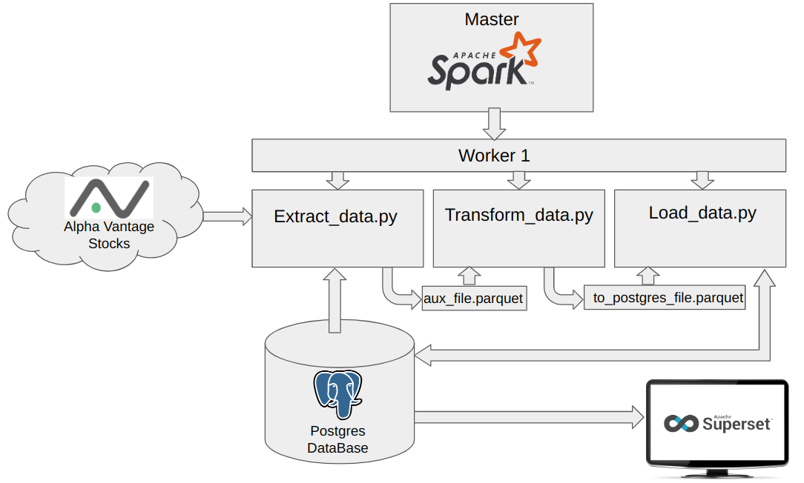

# 1. ETL de acciones financieras en base a Spark,  Postgres y Superset 

La idea de este proyecto es hacer un ETL que obtenga los valores de acciones de cualquier API, para este caso se usa Alpha Vantage.
Para este se usa Docker con Spark para ejecutar el codigo con ayuda de la  librerìa 'pyspark' y los datos procesados llevarlo a una base de datos como Posgres. 
Luego para la visualización, se usa Superset donde se pueden armar Dashboards o gráficos como se muestra a continuación:

# 2. Descripción  

Este proyecto conformados por tres pates:
    a) Spark para las ejecuciones de código. Está conformado por un Master y un Worker 1

    b) Base de datos Posgres--> Tabla 'stocks'

    c) Superset para visualizar las acciones

En el siguiente gráfico se muestra la cofiguracióm
    

# 3. Instalación:

Bajar o hacer clone a la siguiente [URL](https://github.com/Marcos10452/docker_etl_v1.git)

# 4. Uso  

Para hacer correr los docker se debe ejecutar el bash 'contrl_env.sh' el cual arma el esquema del gráfico anterior en base al 'docker-compose.yml'
    ./control_env.sh start --> corre los dockers
    ./control_env.sh stop --> para los dockers

Luego de arrancar los dockers, ejecutar el bash 'etl_stocks_v0.sh'
    ./etl_stocks_v0.sh --> ejecuta los scripts .py en el Worker 1

Como indica el esquema anterior, el Worker 1 ejecuta tres codigos separados que se describen a continuacoines

    a) Extract_data.py
        -Se conecta a AlphaVantage app para obtener las acciones definidas.Para este ejemplo se usan 20 acciones de diferentes rubros. 
        -Se verifica cual fué la última actualización de la base de datos usando la librerìa pyspark.
        -Genera un archivo 'aux_file.parquet' con todos los nuevos datos 

    b) Transform_data.py
        -Ingresa los datos del archivo 'aux_file.parquet'.
        -Para este ejemplo se calcula la media movil a 3, 5, 15 y 30 días.
        -El resultado se guarda en el 'archivo to_postgrest_file.parquet'.  
    
    c) Load_data.py
        -Ingresa los datos del archivo 'archivo to_postgrest_file.parquet'.
        -Lee la última actualizacón de la base de datos.
        -Compara la fecha del archivo contra la base de datos. Si esta diferencia es mayor a 0, actualiza la base de datos con los últimos datos.

Para ver los gráficos de las acciones se ingresa a Superset a través de cualquier browser :
    a)  http://localhost:8088
        Usuario: marcos 
           Pass: marcos

    

# 5. Futuro

Para mas adelante se plante obtener otros datos financieros, como noticias o balances trimestrales de empresas. Y con esto poder procesarlos para obtener otros features como analisis sentimental de las noticias.

